# Whakoom Desktop

Cliente de escritorio **no oficial** de [Whakoom](https://www.whakoom.com), escrito en Rust con una interfaz nativa egui. Sin Electron. Catálogo real, colección y cuenta en una sola aplicación.


La captura usa títulos públicos y una biblioteca de ejemplo; no contiene una sesión real.

Mi biblioteca abre en **Tomos faltantes**, mostrando el tomo de menor numeración que te falta en cada serie desde la caché, con actualización en segundo plano. La barra permite cambiar a **Series** o **Tomos**, y cada edición permite alternar entre **Todos, Tengo y Faltan**. Las tarjetas siguen abriendo durante la carga. La cuenta tiene sus secciones arriba, un diálogo para editar foto, nombre público y biografía e **Insignias** locales derivadas de tu biblioteca.

## Descargar 3.2.0

[Descargas y notas de la versión](https://github.com/xXKuroiKenshiXx/whakoom-desktop/releases/tag/v3.2.0)

| Sistema | Archivo | Requisitos |
| --- | --- | --- |
| Windows | `Whakoom-Desktop-3.2.0-setup.exe` | Windows 10/11, x64 |
| Windows portable | `Whakoom-Desktop-3.2.0.exe` o ZIP | Mismos requisitos; no requiere instalación |
| Linux | `Whakoom-Desktop-3.2.0-x86_64.AppImage` | x86_64, glibc 2.39 o posterior, OpenGL, X11/Wayland |

En Linux: `chmod +x Whakoom-Desktop-3.2.0-x86_64.AppImage` y ejecutá el archivo. Si FUSE no está disponible, usá `./Whakoom-Desktop-3.2.0-x86_64.AppImage --appimage-extract-and-run`. Para recordar la sesión necesitás un servicio Secret Service desbloqueado, como GNOME Keyring o KWallet compatible. La verificación adicional mediante navegador integrado está disponible únicamente en Windows y requiere WebView2; el inicio con credenciales usa HTTPS en ambos sistemas.

Los binarios no tienen firma de código comercial. Compará su SHA-256 con `SHA256SUMS.txt` de la misma publicación. Portable significa que no necesita instalador: los datos siguen en la carpeta de usuario, separados del ejecutable.

## Funciones

- Colaborar con el catálogo real: Crear ficha desde Catálogo; Modificar ficha y Sugerir un cambio en series y tomos; Añadir tomos en series. Los formularios originales conservan las validaciones y permisos de Whakoom. En Windows se integran con la sesión conectada; en Linux se abren en el navegador predeterminado, donde necesitás tu sesión de Whakoom. Sólo se publica al confirmar en el formulario oficial. [Creación de fichas](https://whakoom.zendesk.com/hc/es/articles/205934241), [correcciones](https://whakoom.zendesk.com/hc/es/articles/205934431) y [sugerencias](https://whakoom.zendesk.com/hc/es/articles/205934441).

- Insignias: 18 logros locales con medallas, progreso, aviso y sonido al desbloquear. Se guardan por cuenta y en el respaldo; no se repiten al reiniciar. El sonido tiene una opción propia en Ajustes y los destellos respetan Animaciones. En Linux el sonido usa `paplay` o `aplay`, si están instalados.
- Etiqueta Pro para tu cuenta y otras personas cuando aparece la marca de suscripción en los datos de Whakoom. No depende de las insignias locales ni habilita servicios de pago.

- Catálogo ordenado en Buscar, Explorar, Listas y Usuarios; historial de búsquedas y visitas.
- Actualizaciones desde la aplicación: aviso de nuevas versiones, descarga verificada por SHA-256 e instalación con reinicio.
- Listado Manga dentro de la app: búsqueda por variantes del título, resultados con portadas, fichas y enlaces por serie/tomo. Vista nativa en ambos sistemas y página original integrada en Windows.
- Comprar abre un selector de tiendas de Whakoom; Mercado Libre busca el título y número del tomo.
- Fichas con ISBN, cantidad de personas que tienen el título, votos y opiniones reales. Escribir y editar tu opinión pública con confirmación online.
- Visor de portadas en primer plano: rueda, arrastre, controles de zoom y cierre con Escape. La tarjeta del catálogo, incluida su portada, abre la ficha interna. El visor se abre al pulsar la portada dentro de la ficha.
- Estadísticas anuales de compras y lecturas, comparación mensual y fecha de compra automática al marcar «Lo tengo», editable desde la ficha.
- Comunidad y ayuda oficial: categorías, publicaciones y respuestas públicas; formularios para reportar, proponer y comentar.
- Explorar: populares, mejor valorados, novelas gráficas y todos los cómics. Deseados reúne `/buscados`, el servicio paginado y el perfil propio, conservando tomos y series sin duplicados, con filtros Todos, Series y Tomos. Esta sección reúne el estado «Lo quiero»; no hay un segundo favorito de cómics.
- Listas: descubrir, favoritas, propias y creación online con tomos ordenados, privacidad y tipo de lista.
- Historial local de búsquedas y títulos visitados. Miniaturas rápidas que mejoran su resolución en segundo plano.
- Biblioteca por tomos o series; añadir y quitar series completas. Actualización automática al entrar y al abrir fichas.
- Colección, deseados, lectura y valoración personal con cola persistente y reintentos online.
- Búsqueda de usuarios y perfiles con Actividad, Comicteca, Buscados y Listas; seguidos, seguidores y ajustes de cuenta conectados a Whakoom.
- Estrellas doradas de comunidad y, debajo, estrellas violetas interactivas con tu puntaje; votos visibles en las fichas.
- Tema claro/oscuro, transiciones y portadas holográficas con marco iridiscente. Animaciones desactivables.
- Inicio guiado para elegir caché y calidad de las imágenes; alta calidad por defecto. Configuración por espacio, cantidad, resolución y uso de memoria, con ejemplos visuales de calidad.
- Ajustes separados en General, Almacenamiento, Respaldo y Actualizaciones. Optimización de imágenes sin pérdida en segundo plano, conservando el original cuando ocupa menos.
- Notas, calendario, emojis, etiquetas, objetivos, estadísticas y respaldos JSON/CSV.
- Destacar o relegar opiniones para tu propia biblioteca.
- Español, inglés, portugués, ruso y chino; fuentes de respaldo sin reemplazar la tipografía principal.
- Personas: Seguidos, Seguidores y Favoritos locales con corazón, actividad, carruseles infinitos y desplazamiento horizontal.
- Relecturas, orden de lectura, ubicación, conservación y fotos de firmas en el respaldo. [Comparación con herramientas Pro](docs/local-features.md).

<details>
<summary>Catálogo, listas y ajustes</summary>


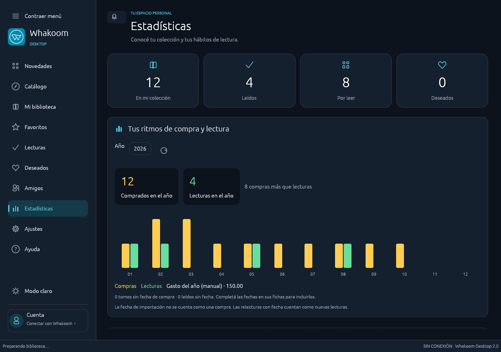

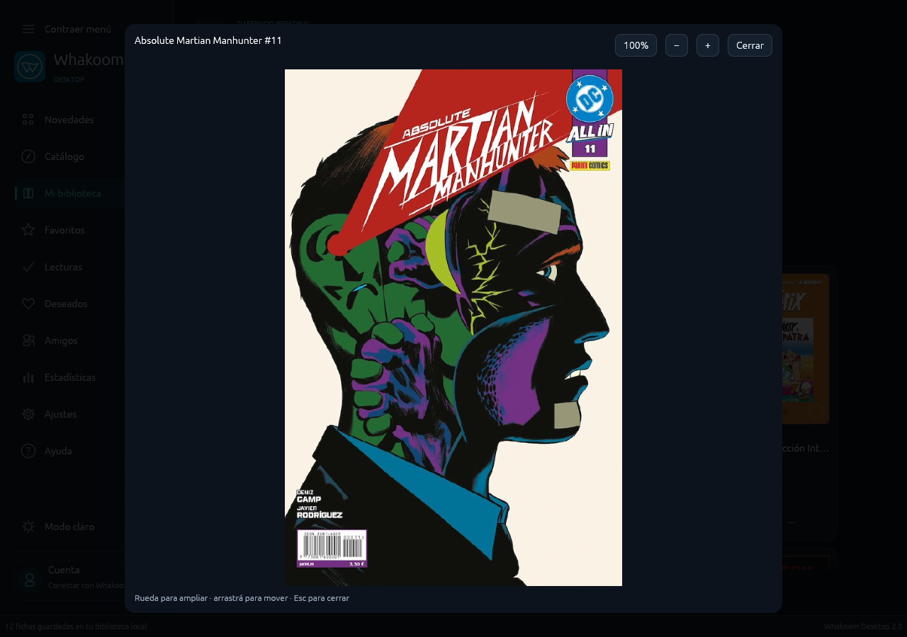


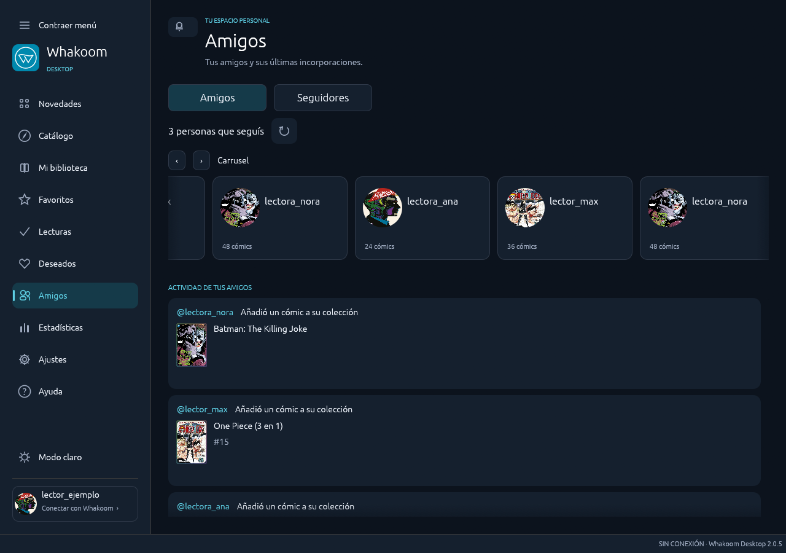

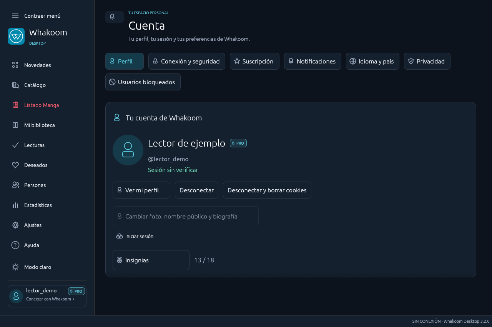

La cuenta de esta captura es ficticia; su indicador Pro no representa una suscripción real.

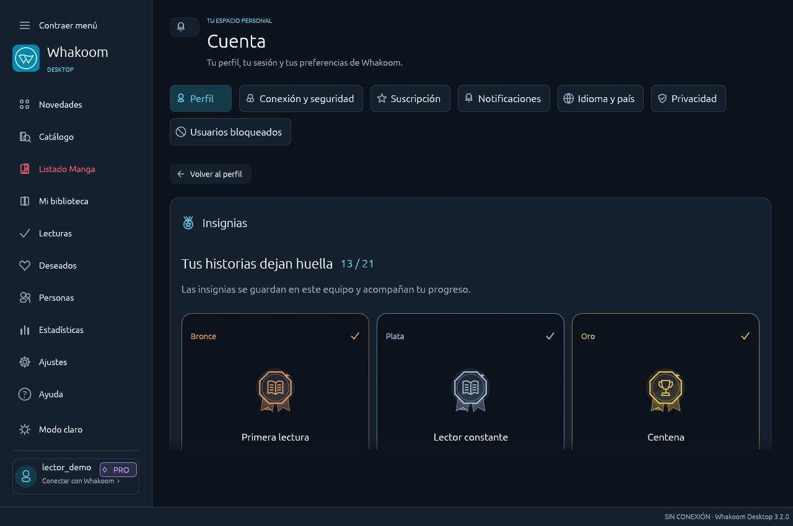

La vista de insignias utiliza una cuenta y progresos ficticios; no muestra una suscripción ni una sesión real.

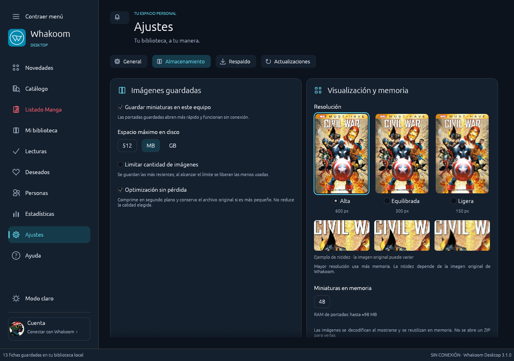

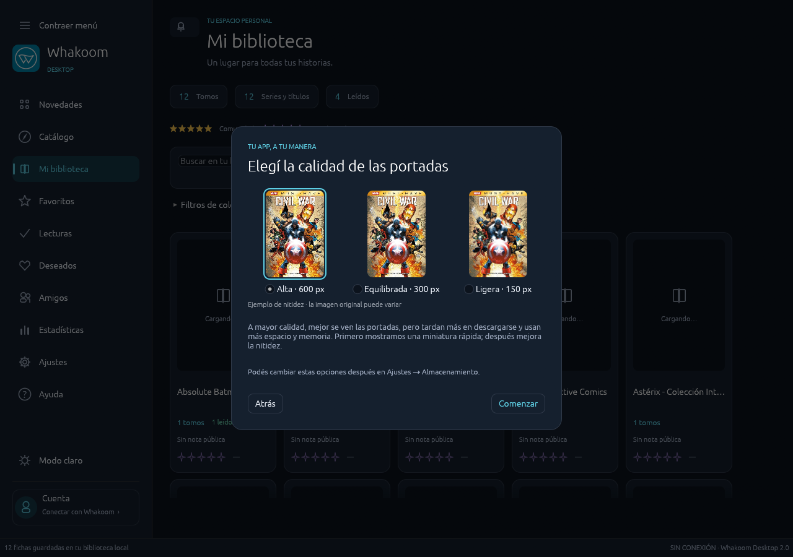

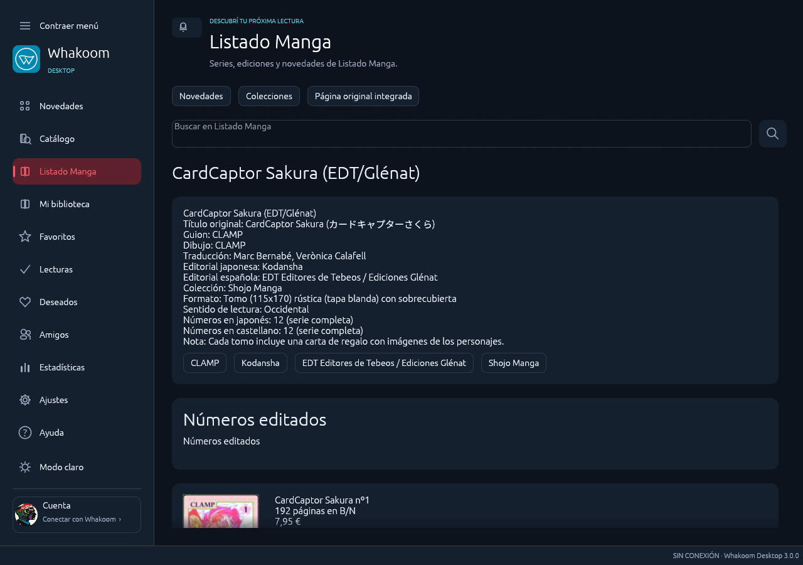

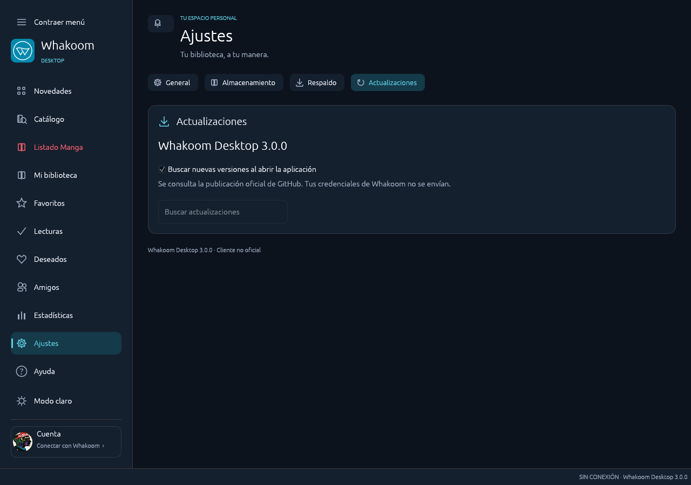

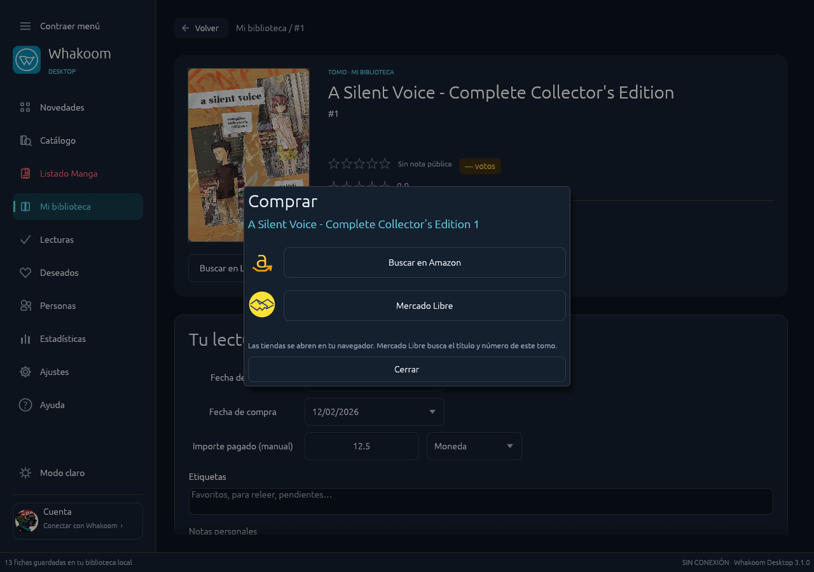

</details>

## Conexión y datos

La aplicación utiliza HTTPS, los servicios internos del cliente web de Whakoom y lectura de sus páginas. **No utiliza una API pública oficial ni tiene afiliación con Whakoom.** Los cambios de la web pueden requerir actualizar el conector.

La interfaz aplica los cambios localmente al momento. Con sesión y conexión, intenta enviarlos automáticamente; sólo los confirma cuando se verifica el estado del servidor. Las operaciones grandes usan tandas limitadas y conservan los pendientes ante errores. No puede garantizar una confirmación online instantánea ni eludir permisos del servidor.

Las estadísticas locales funcionan sin Pro. Las nuevas altas con «Lo tengo» usan la fecha del día, que podés editar en la ficha; las compras históricas conservan sus fechas conocidas. Importar un título no supone que lo hayas comprado ese día. Las lecturas originales se consultan sólo si la cuenta tiene permiso: el servidor puede exigir Pro. Los datos mensuales autorizados reemplazan los registros locales de ese mes, sin sumarlos dos veces.

La sección Ayuda consulta la API pública de Zendesk sin enviar cookies de Whakoom. Reportes y comentarios usan los formularios oficiales y su propia sesión: en Windows se muestran dentro de la aplicación mediante WebView2; en Linux se abren en el navegador. No se reutiliza la contraseña ni se comparten credenciales entre los dos servicios.

Las tiendas se abren en el navegador; no se realizan compras dentro de la aplicación. Amazon se muestra cuando la ficha ofrece un enlace de Whakoom; cuando no lo ofrece, se identifica como una búsqueda en Amazon. Mercado Libre se adapta al país asociado a la moneda elegida y usa Argentina por defecto.

La comprobación de actualizaciones consulta únicamente el repositorio de este proyecto en GitHub, sin cookies de Whakoom. La instalación requiere una acción explícita dentro de la app, verifica SHA-256 y conserva los datos. Windows portable espera al cierre y mantiene una copia del ejecutable anterior; la instalación normal ejecuta el nuevo instalador después del cierre y vuelve a abrir la app. Linux reemplaza la AppImage con escritura atómica si su carpeta permite escribir. No se distribuyen firmas comerciales.

Gastos, etiquetas, objetivos y reacciones a opiniones son locales. El gasto usa **importes que introducís manualmente**. Podés seleccionar la moneda en cada ficha; los totales se agrupan por moneda y no convierten divisas. Los registros anteriores conservan «sin moneda definida» hasta que les asignes una moneda. Las notas online dependen de los permisos que Whakoom conceda a la cuenta. Las herramientas locales no desbloquean funciones Pro del servicio.

La contraseña no se guarda. Windows protege la sesión con DPAPI; Linux usa el llavero Secret Service. Los respaldos excluyen credenciales, pero incluyen datos personales de biblioteca. Consultá [seguridad](SECURITY.md) y [arquitectura](docs/architecture.md).

## Compilar

Requiere Rust 1.95 o posterior y el entorno de compilación del sistema. En Windows, usá MSVC con Windows SDK. En Ubuntu:

```sh
sudo apt install build-essential pkg-config libdbus-1-dev libssl-dev \
  libx11-dev libxi-dev libxkbcommon-dev libxkbcommon-x11-dev libwayland-dev libgl1-mesa-dev
cargo test --locked --all-targets
cargo clippy --locked --all-targets -- -D warnings
cargo run --locked --bin whakoom-desktop
```

Empaquetado: `tools/package.ps1` genera el portable Windows; `makensis tools/installer.nsi` genera el instalador; `bash tools/package-linux.sh` genera AppImage. El script Linux verifica hashes de sus herramientas. Si un archivo del canal `continuous` cambia, falla hasta revisar y actualizar su hash.

[Contribuir](CONTRIBUTING.md) · [Cambios](CHANGELOG.md) · [Validación](VALIDATION.md)

## Licencia

Código bajo [MIT](LICENSE). La marca Whakoom, portadas, avatares y contenido de terceros pertenecen a sus titulares. La licencia del código no concede derechos sobre esos recursos.

Las fuentes incluyen licencias propias, detalladas en [avisos de terceros](THIRD_PARTY_NOTICES.md).

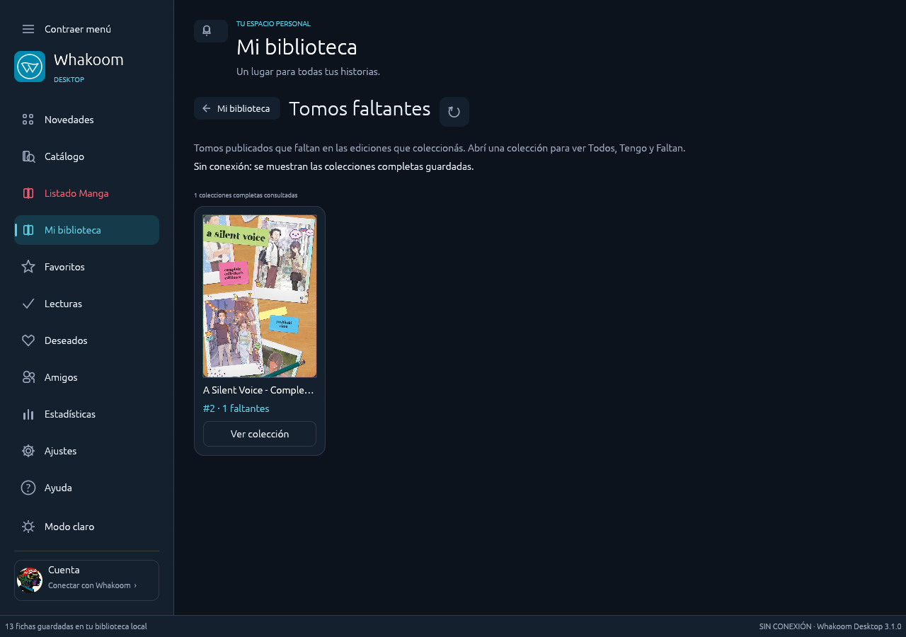


