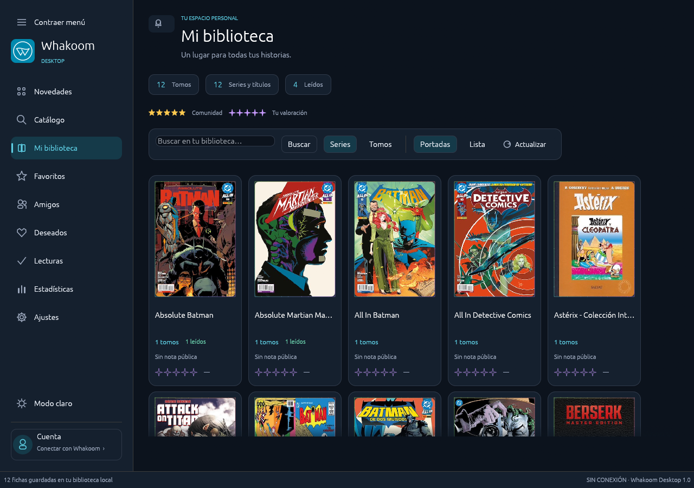
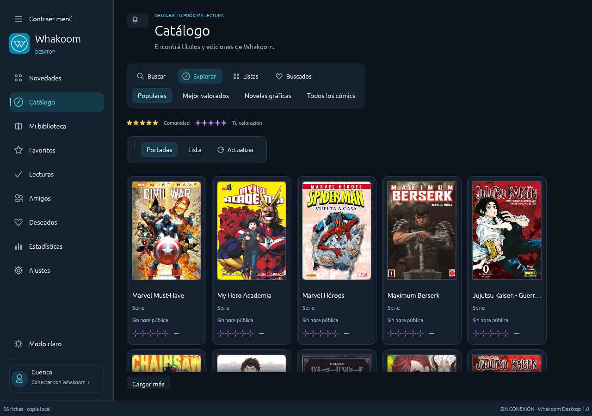
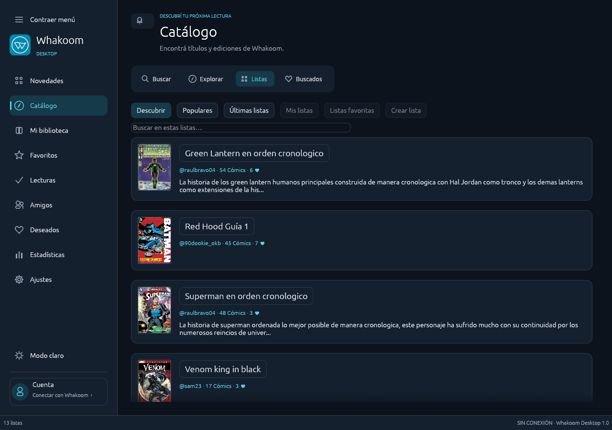

# Whakoom Desktop

Cliente de escritorio **no oficial** de [Whakoom](https://www.whakoom.com), escrito en Rust con una interfaz nativa egui. Sin Electron. Catálogo real, colección y cuenta en una sola aplicación.



La captura usa títulos públicos y una biblioteca de ejemplo; no contiene una sesión real.

## Descargar 1.0

[Descargas y notas de la versión](https://github.com/xXKuroiKenshiXx/whakoom-desktop/releases/tag/v1.0.0)

| Sistema | Archivo | Requisitos |
| --- | --- | --- |
| Windows | `Whakoom-Desktop-1.0-setup.exe` | Windows 10/11, x64 |
| Windows portable | `Whakoom-Desktop-1.0.exe` o ZIP | Mismos requisitos; no requiere instalación |
| Linux | `Whakoom-Desktop-1.0-x86_64.AppImage` | x86_64, glibc 2.39 o posterior, OpenGL, X11/Wayland |

En Linux: `chmod +x Whakoom-Desktop-1.0-x86_64.AppImage` y ejecutá el archivo. Si FUSE no está disponible, usá `./Whakoom-Desktop-1.0-x86_64.AppImage --appimage-extract-and-run`. Para recordar la sesión necesitás un servicio Secret Service desbloqueado, como GNOME Keyring o KWallet compatible. La verificación adicional mediante navegador integrado está disponible únicamente en Windows y requiere WebView2; el inicio con credenciales usa HTTPS en ambos sistemas.

Los binarios no tienen firma de código comercial. Compará su SHA-256 con `SHA256SUMS.txt` de la misma publicación. Portable significa que no necesita instalador: los datos siguen en la carpeta de usuario, separados del ejecutable.

## Funciones

- Catálogo, fichas, portadas y opiniones reales de tomos y ediciones.
- Explorar: populares, mejor valorados, novelas gráficas y todos los cómics; Buscados conectado a tu cuenta.
- Listas: descubrir, favoritas, propias y creación online con tomos ordenados, privacidad y tipo de lista.
- Historial local de búsquedas y títulos visitados. Miniaturas rápidas que mejoran su resolución en segundo plano.
- Biblioteca por tomos o series; añadir y quitar series completas. Actualización automática al entrar y al abrir fichas.
- Colección, deseados, lectura y valoración personal con cola persistente y reintentos online.
- Perfil, amigos, actividad y ajustes de cuenta conectados a Whakoom.
- Estrellas doradas de comunidad y violetas personales; votos visibles en las fichas.
- Tema claro/oscuro, transiciones y portadas holográficas con marco iridiscente. Animaciones desactivables.
- Caché configurable por espacio, cantidad, resolución y uso de memoria.
- Notas, calendario, emojis, etiquetas, objetivos, estadísticas y respaldos JSON/CSV.
- Destacar o relegar opiniones para tu propia biblioteca.
- Español, inglés, portugués, ruso y chino; fuentes de respaldo sin reemplazar la tipografía principal.
- Amigos con zoom, carrusel opcional y desplazamiento horizontal; ajustes adaptables al ancho de ventana.
- Relecturas, orden de lectura, ubicación, conservación y fotos de firmas en el respaldo. [Comparación con herramientas Pro](docs/local-features.md).

<details>
<summary>Catálogo y listas</summary>





</details>

## Conexión y datos

La aplicación utiliza HTTPS, los servicios internos del cliente web de Whakoom y lectura de sus páginas. **No utiliza una API pública oficial ni tiene afiliación con Whakoom.** Los cambios de la web pueden requerir actualizar el conector.

La interfaz aplica los cambios localmente al momento. Con sesión y conexión, intenta enviarlos automáticamente; sólo los confirma cuando se verifica el estado del servidor. Las operaciones grandes usan tandas limitadas y conservan los pendientes ante errores. No puede garantizar una confirmación online instantánea ni eludir permisos del servidor.

Gastos, etiquetas, objetivos y reacciones a opiniones son locales. El gasto suma **importes que introducís manualmente**: no obtiene precios del catálogo, no identifica una moneda y no convierte divisas. Usá una misma moneda para que el total tenga sentido. Las notas online dependen de los permisos que Whakoom conceda a la cuenta. Las herramientas locales no desbloquean funciones Pro del servicio.

La contraseña no se guarda. Windows protege la sesión con DPAPI; Linux usa el llavero Secret Service. Los respaldos excluyen credenciales, pero incluyen datos personales de biblioteca. Consultá [seguridad](SECURITY.md) y [arquitectura](docs/architecture.md).

## Compilar

Requiere Rust 1.95 o posterior y el entorno de compilación del sistema. En Windows, usá MSVC con Windows SDK. En Ubuntu:

```sh
sudo apt install build-essential pkg-config libdbus-1-dev libssl-dev \
  libx11-dev libxi-dev libxkbcommon-dev libwayland-dev libgl1-mesa-dev
cargo test --locked --all-targets
cargo clippy --locked --all-targets -- -D warnings
cargo run --locked --bin whakoom-desktop
```

Empaquetado: `tools/package.ps1` genera el portable Windows; `makensis tools/installer.nsi` genera el instalador; `bash tools/package-linux.sh` genera AppImage. El script Linux verifica hashes de sus herramientas. Si un archivo del canal `continuous` cambia, falla hasta revisar y actualizar su hash.

[Contribuir](CONTRIBUTING.md) · [Cambios](CHANGELOG.md) · [Validación](VALIDATION.md)

## Licencia

Código bajo [MIT](LICENSE). La marca Whakoom, portadas, avatares y contenido de terceros pertenecen a sus titulares. La licencia del código no concede derechos sobre esos recursos.

Las fuentes incluyen licencias propias, detalladas en [avisos de terceros](THIRD_PARTY_NOTICES.md).
