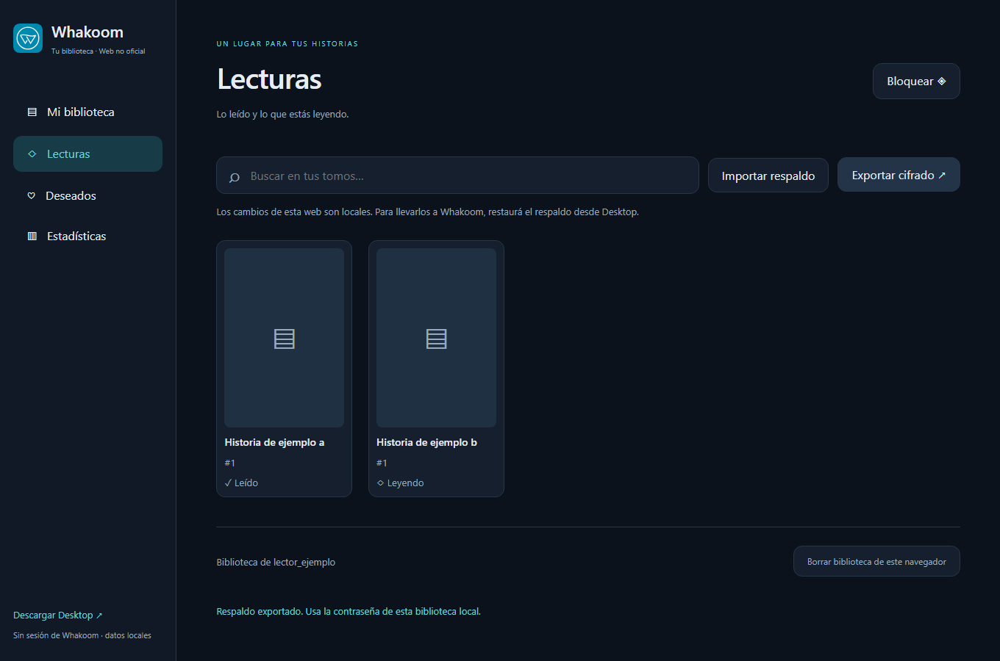

# Biblioteca web para Netlify

Aplicación Astro separada del cliente Rust. Biblioteca, lecturas, deseados, notas y estadísticas se abren desde un respaldo de Desktop. Los cambios son locales; para enviarlos a Whakoom, exportá el respaldo y restauralo desde Desktop.

No incluye inicio de sesión ni conexión directa a Whakoom. No pide su contraseña o cookies. El login online necesita un servidor y resolver las validaciones del servicio; Netlify por sí solo no convierte el cliente nativo en una aplicación web autenticada.

## Desarrollo y despliegue

Node 22.12 o posterior (se recomienda Node 24): `npm ci`, `npm test`, `npm run dev`. `npm run build` genera `web/dist`; `npm run preview` permite revisar el resultado.

`npx playwright install chromium` prepara el navegador de pruebas. Con el servidor local abierto, `npm run test:browser` verifica importación, persistencia cifrada, exportación, bloqueo, contraseñas incorrectas y diseño móvil con datos ficticios. `SCREENSHOT_DIR` permite guardar las capturas fuera del repositorio.

Para Netlify, conectá este repositorio y usá su `netlify.toml`: base `web`, comando `npm run build`, publicación `dist`. No se crea GitHub Pages. El despliegue requiere acceso a una cuenta Netlify y no se activa desde el repositorio automáticamente.

## Datos privados

- IndexedDB guarda un sobre AES-256-GCM autenticado. PBKDF2-HMAC-SHA256 con 600 000 iteraciones y sal aleatoria deriva una clave no exportable; cada guardado tiene un nonce aleatorio nuevo.
- La contraseña y la clave no se guardan en cookies ni localStorage. La clave vive en memoria hasta bloquear o cerrar la página. No es una cuenta online.
- Los respaldos `.whakoom` usan el mismo formato que Desktop. La exportación web usa la contraseña de la biblioteca del navegador, que puede ser distinta de la del archivo importado.
- La caché del service worker sólo contiene archivos públicos de la interfaz; no incluye biblioteca, notas ni credenciales. Las portadas se solicitan al CDN público de Whakoom sin enviar la contraseña de la biblioteca.
- Una contraseña perdida no se puede recuperar. Borrar los datos del sitio también borra la biblioteca local: mantené respaldos cifrados.
- El cifrado en reposo no protege contra extensiones maliciosas, malware o un servidor que entregue JavaScript comprometido. Los archivos importados se muestran como texto; se restringen imágenes externas y se configura CSP en Netlify.

No se ofrece almacenamiento en la nube, rankings globales ni sincronización de notas entre navegadores.

